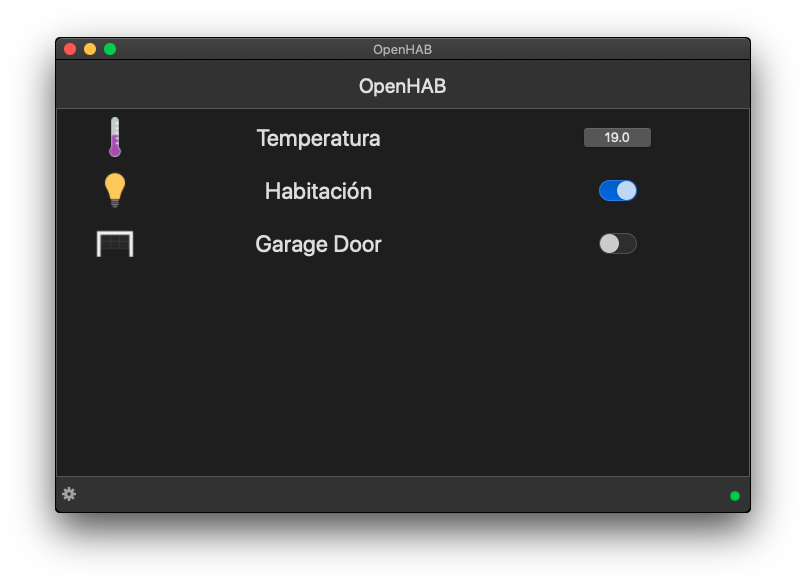
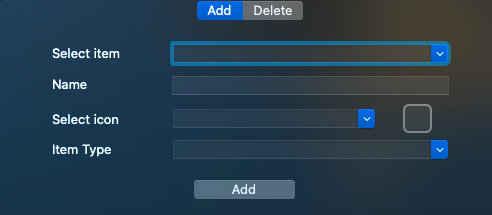
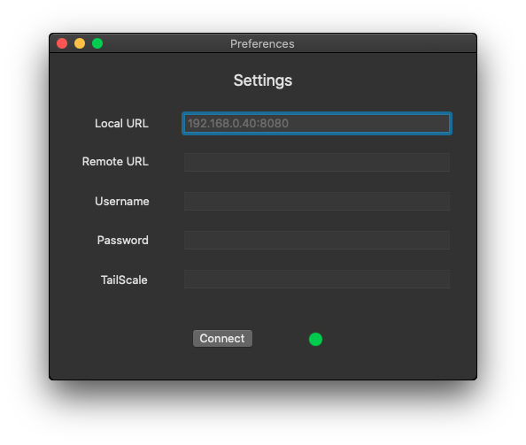

# OpenHAB - MacOS Version

## Caution: It's not an official version! The application is fully under development, and may have errors, it is available to test and improve it. 
Please, if you find any errors, or find any suggestions, it is welcome.

## Introduction

Hi! I wanted to start developing the first native applications for MacOS, totally written in Swift.

## Fatures (at startup)

Being in development, I have only prioritized getting the information from the API for further processing.
Currently you can add icons to be displayed, as well as delete them.

### Add

- Select item: All the icons available in OpenHAB will be displayed, and not only those displayed in Sitemaps.
- Name: The name can be changed. If left blank, the app will assign the name provided in Sitemaps. If this is not available, the item name will be assigned.
- Select icon: You can change the icon, by default the "text" icon is displayed. For now only some default icons are available, provided by OpenHAB (look below).
- Item type: For now, only the label and switch option is available. Both options show the updated values but do not alter the system, that is, the command cannot be sent to OpenHAB (look below).

# Important: When developing the app, initially use the basic access of the OpenHAB API. But at the end of the last commit, I discovered how to obtain the status, icons and type of items, as the iOS app does, so that will be the next release ;)

### Preferences

- For now, only local use is available. Soon, it will be possible to add the external URL and the possibility of including the Tailscale service.

## Trademark Disclaimer

Product names, logos, brands and other trademarks referred to within the openHAB website are the
property of their respective trademark holders. These trademark holders are not affiliated with
openHAB or our website. They do not sponsor or endorse our materials.

Apple, the Apple logo, MacOS are trademarks of Apple Inc., registered in the U.S. and other countries and regions. App Store is a service mark of Apple Inc.
